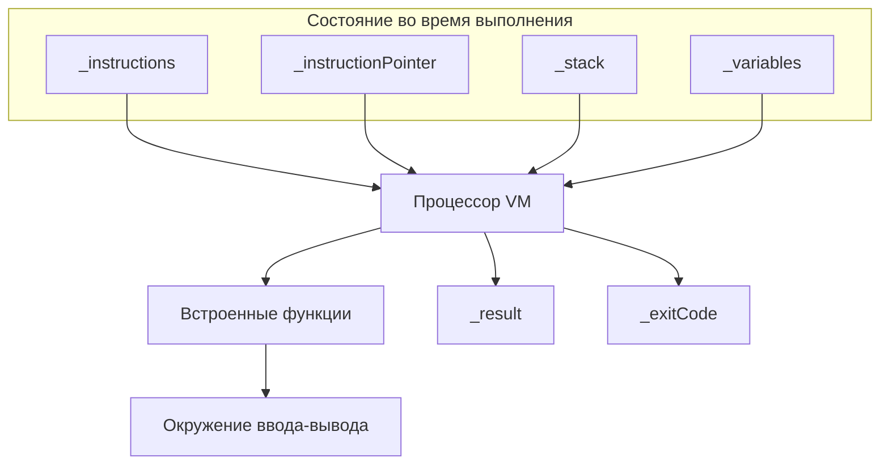

# Виртуальная машина Minion

Виртуальная машина Minion выполняет инструкции по определённым правилам, тем самым обеспечивая возможность вычисления любой программы на Minion.

## Иллюстрация
Иллюстрация структуры и состояния виртуальной машины Minion в момент выполнения программы:

## Модель виртуальной машины
Структура виртуальной машины состоит из следующих элементов:

1. Список инструкций, составляющих программу;
2. Указатель на следующую инструкцию;
3. Стек значений, используемый для вычисления выражений и хранения промежуточных результатов;
4. Таблица переменных — цепочка таблиц для поддержки лексических областей видимости;
5. Процессор виртуальной машины — центральный исполнительный цикл;
6. BuiltinFunctions — модуль встроенных функций, вызываемый процессором;
7. stdin / stdout Environment — внешнее окружение ввода-вывода.

## Инструкции
Каждая инструкция программы содержит:

1. Код инструкции из набора инструкций;
2. Значение операнда.

### Набор инструкций
Каждая инструкция может иметь один операнд, который хранится вместе с инструкцией.

**Условные обозначения в списке инструкций:**

* Операнд указывается в квадратных скобках, например: `[Value]`;
* Вершина стека вычислений обозначается `EVAL[^1]`, следующее за ней значение — `EVAL[^2]`, `EVAL[^3]` и так далее;
* Каждая инструкция имеет свой номер (индекс), нумерация инструкций начинается с 0.

#### Список инструкций

#### Управление стеком и переменными

1. `Push [Value]` добавляет значение на стек вычислений
   * Операнд хранит добавляемое значение

2. `Pop` удаляет значение со стека вычислений
   * Снимает EVAL[^1] со стека и отбрасывает его

3. `LoadVar [Name]` читает значение переменной
   *   Операнд хранит имя переменной (строка)
   *   Ищет переменную в текущей цепочке таблиц
   *   Помещает найденное значение в стек вычислений
   *   Бросает исключение, если переменная не найдена

4. `DefineVar [Name]` записывает в новую переменную с именем `[Name]` значение `EVAL[^1]`
   *   Снимает одно значение со стека вычислений
   *   Операнд хранит имя переменной
   *   Бросает исключение, если переменная с таким именем уже объявлена

5. `StoreVar [Name]` записывает в уже объявленную переменную `[Name]` значение `EVAL[^1]`
   *   Снимает значение со стека вычислений
   *   Операнд хранит имя переменной
   *   Бросает исключение, если переменная не была объявлена

6. `PushVars [Depth]` вход во вложенную область видимости
   *   Создаёт новую таблицу переменных, дочернюю по отношению к указанной таблице переменных
   *   Операнд хранит глубину родителя:
        * Если операнд равен 0, то новая таблица переменных создаётся без ссылки на родительскую
    *   Новая таблица становится текущей
   *   Новая таблица переменных имеет глубину на 1 больше, чем родительская

7. `PopVars` выход из текущей области видимости
   *   Удаляет текущую таблицу переменных
   *   Текущей становится родительская таблица

#### Арифметические операции

8. `Add` выполняет бинарную операцию сложения или конкатенации
   *   Вычисляет `EVAL[^2] + EVAL[^1]`
   *   Типы:
        *   Два `Int` → `Int`;
        *   Два `Float` → `Float`;
        *   Две `String` → `String` (конкатенация);
        *   Иначе → исключение.
   *   Снимает два значения со стека, результат помещает в стек

9. `Subtract` выполняет бинарную операцию вычитания
   *   Вычисляет `EVAL[^2] - EVAL[^1]`
   *   Допустимы только пары `Int` или `Float` (без смешения типов)
   *   Снимает два значения со стека, результат помещает в стек

10. `Multiply` выполняет бинарную операцию умножения
   *   Вычисляет `EVAL[^2] * EVAL[^1]`
   *   Допустимы только пары `Int` или `Float`.
   *   Снимает два значения со стека, результат помещает в стек

11. `Divide` выполняет бинарную операцию деления
   *   Вычисляет `EVAL[^2] / EVAL[^1]`
   *   Допустимы только пары `Int` или `Float`.
   *   Снимает два значения со стека, результат помещает в стек

12. `Power` выполняет возведение в степень
    *   Вычисляет `EVAL[^2] ^ EVAL[^1]`
    *   Допустимы только два `Float`, иначе исключение
    *   Снимает два значения со стека, результат помещает в стек

13.  `Modulo` выполняет операцию остатка от деления
     *   Вычисляет `EVAL[^2] % EVAL[^1]`
     *   Допустимы только два `Int`
     *   Снимает два значения со стека, результат помещает в стек

14. `Negate` выполняет унарную операцию "минус"
    *   Допустимы типы `Int` или `Float`
    *   Снимает значение со стека, результат помещает в стек

#### Вызов функций

15. `CallBuiltin [Code]` вызывает встроенную функцию
    *   Операнд — целый код BuiltinFunctionCode: Print, InputInt, InputFloat, InputString, StringLength, StringSubstring
    *   Указатель инструкций не меняется
    *   Аргументы берутся со стека: `EVAL[^1]` — последний аргумент, `EVAL[^N]` — первый.
    *   Возвращаемое значение (если есть) кладётся на стек (`EVAL[^1]`)
    *   Функция `Print` не возвращает значения на стек

#### Завершение программы

16. `StoreResult` запоминает результат выполнения программы
    *   Снимает `EVAL[^1]` и запоминает как результат выполнения программы

17. `Halt` останавливает работу программы
    *   Снимает `EVAL[^1]` и интерпретирует его как целочисленный код завершения